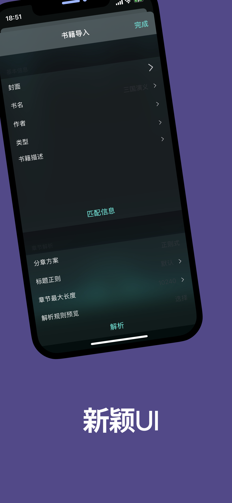
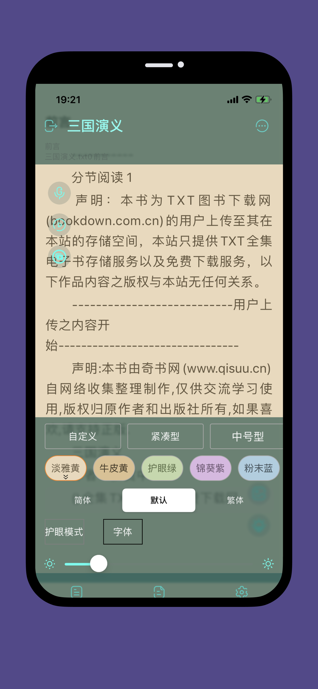

# 源阅

  
  <h1>源阅</h1>
   
  
『源阅』 - 一款本地阅读器工具，为广大网络文学爱好者提供一种方便、快捷舒适的试读体验。

> 源阅是一个非常完善专注内容的工具。拥有简洁、美观的UI，以及丰富的功能。

* 提供丰富的主题自定义
* 丰富美观的阅读样式

> 其它功能不一一介绍，请自己探索。
> 由于各个地区的法规不同，各地区的功能也会有所区别。

## 下载

### iOS版本

正在提交审核中，敬请期待。

<!-- Appstore正式版： [AppStore](https://apps.apple.com/cn/app/%E6%BA%90%E9%98%85%E8%AF%BB/id1561787704)

TF测试版： [testflight版本](https://testflight.apple.com/join/2Svrtr9y) -->

   

